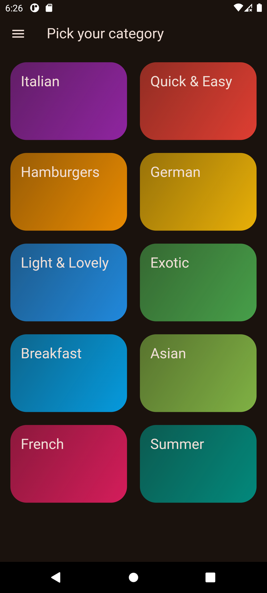
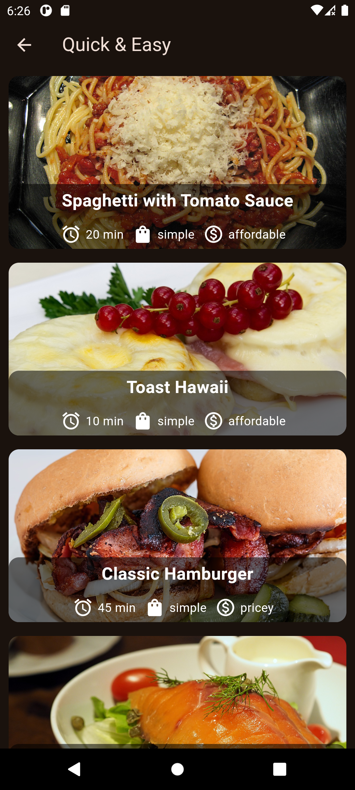
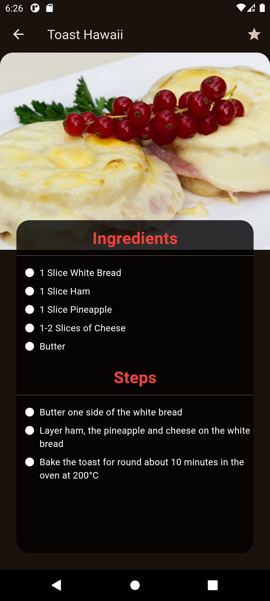

# meals_app_vf

A new Flutter project.

<div style="display: flex; justify-content: space-evenly;">
  
  
  
</div>

## Getting Started

### Prerequisites

Make sure you have Flutter installed on your machine. You can follow the official [Flutter installation guide](https://flutter.dev/docs/get-started/install) for your operating system.

### Installation

1. Clone the repository:
    ```sh
    git clone https://github.com/RAFYA-Hamza/meals-app-flutter.git
    ```
2. Navigate to the project directory:
    ```sh
    cd meals-app-flutter
    ```
3. Get the required dependencies:
    ```sh
    flutter pub get
    ```

### Running the App

